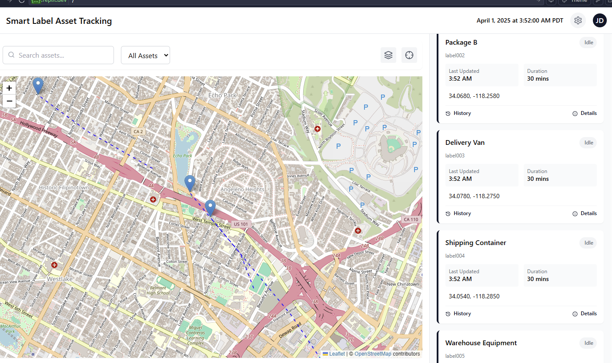

# InPlay Live Asset Tracking Dashboard


A powerful, real-time asset tracking platform with interactive maps and comprehensive monitoring capabilities. This application provides a full-featured dashboard for tracking assets in both simulated demo and real-time environments.

## Features

- **Interactive Map Visualization** - Color-coded routes, markers, and comprehensive map controls
- **Dual Operation Modes** - Run in either Demo mode with simulated data or Real-time mode with live tracking
- **ShipRec API Integration** - Connect with the ShipRec API to import real package tracking data
- **Real-time Updates** - WebSocket-powered live position updates
- **Advanced Time Simulation** - Control simulation speed with mode-specific time scales
- **Road-Aware Routing** - Routes strictly follow public roads and major streets
- **Responsive Design** - Works on desktop, tablet, and mobile devices

## Getting Started

### Prerequisites

- Node.js and npm installed
- ShipRec API key (for real-time tracking features)

### Installation

1. Clone the repository
   ```
   git clone https://github.com/yourusername/inplay-tracking.git
   cd inplay-tracking
   ```

2. Install dependencies
   ```
   npm install
   ```

3. Start the development server
   ```
   npm run dev
   ```

4. Open your browser and navigate to `http://localhost:5000`

## Usage Modes

### Demo Mode

Demo mode uses simulated data to demonstrate the system's capabilities:

- Pre-configured asset routes
- Time simulation at accelerated rates (1× to 60×)
- Color-coded routes for different asset types
- Comprehensive tracking history

### Real-time Tracking Mode

Real-time mode connects to actual tracking devices:

- Connect via MAC IDs or ShipRec API
- True real-time tracking (1:1 time scale)
- Adjustable viewing speeds (0.5× to 8×)
- WebSocket-powered instant updates

## Documentation

For detailed usage instructions, refer to these guides:

- [User Guide](./docs/user-guide.md) - For end users of the system
- [Developer Guide](./docs/developer-guide.md) - For developers maintaining or extending the system

## Technology Stack

- **Frontend:** React, TypeScript, Leaflet, TanStack Query
- **UI Components:** shadcn/ui, Tailwind CSS
- **Backend:** Express.js, WebSockets
- **Data Validation:** Zod
- **API Integration:** ShipRec Tracking API

## Project Structure

```
├── client/                # Frontend React application
│   ├── src/               # Source code
│   │   ├── assets/        # Static assets
│   │   ├── components/    # UI components
│   │   ├── hooks/         # Custom React hooks
│   │   ├── lib/           # Utility functions
│   │   ├── pages/         # Page components
│   │   └── types/         # TypeScript type definitions
│   └── index.html         # HTML entry point
├── docs/                  # Documentation
├── server/                # Backend Express server
│   ├── index.ts           # Server entry point
│   ├── routes.ts          # API routes
│   └── storage.ts         # Data storage
├── shared/                # Shared code between client and server
│   └── schema.ts          # Data schemas and types
└── README.md              # This file
```

## License

Copyright © 2025 InPlay Asset Tracking Systems. All rights reserved.

---

## Screenshots


*Dashboard overview showing the map interface and sidebar*


*Real-time tracking mode with ShipRec package integration*


*Detailed package information view*